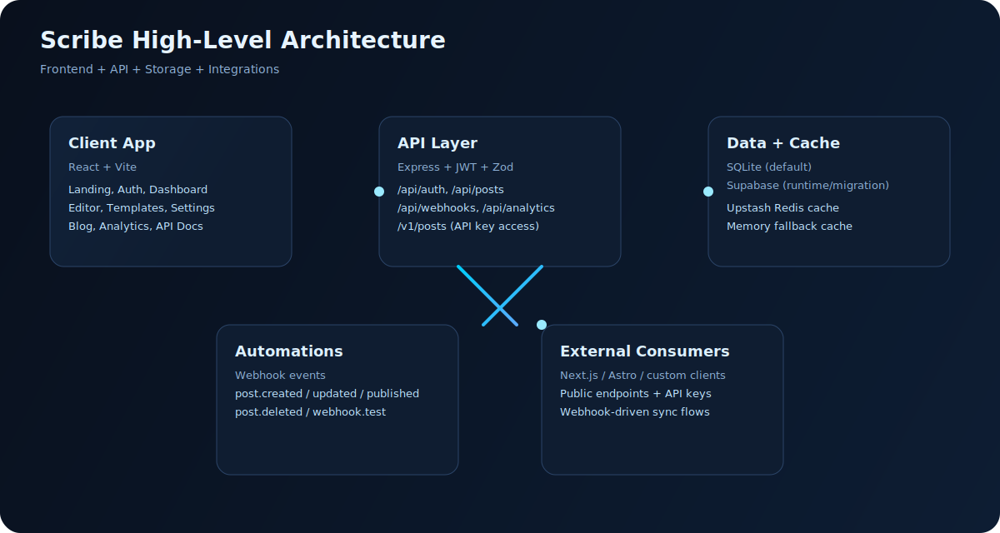

# Scribe

<p align="center">
  <a href="https://github.com/abhishekpandaOfficial/scribe"></a>
  
  
  
  
  
</p>

<p align="center">
  <b>Block-based technical writing SaaS starter</b><br/>
  Draft, publish, distribute, and automate technical content with API-first workflows.
</p>



## Quick Links

- [Why Scribe](#why-scribe)
- [Core Features](#core-features)
- [Architecture](#architecture)
- [Tech Stack](#tech-stack)
- [Quick Start](#quick-start-local)
- [Environment Variables](#environment-variables)
- [API Overview](#api-overview)
- [Webhooks](#webhooks)
- [Supabase Migration](#supabase-runtime-and-migration)
- [Contributing](#contributing)

## Tags

`opensource` `saas` `react` `vite` `express` `sqlite` `supabase` `upstash` `webhooks` `api-first` `technical-writing`

## Why Scribe

Most editors are either too generic for engineering content or too rigid for custom pipelines.

Scribe is the practical middle ground:

- Structured technical editor with rich blocks
- API-first content access for external apps (`/v1/*` + public endpoints)
- Webhook automation on content lifecycle events
- Local-first development with seeded data
- Upgrade path from SQLite to Supabase + Redis cache

## Core Features

- Landing experience with dark/light theme
- Auth (`register`, `login`, JWT session, profile updates)
- Dashboard with KPIs, filters, and quick post actions
- Slash-command editor (`/`) with 20+ block types
- Live preview + publishing flow
- Templates, API keys, and webhook management
- Public blog/profile routes
- Analytics overview APIs
- Upstash Redis caching with in-memory fallback
- Supabase schema + migration scripts + runtime provider switch

## Architecture

High-level system view:

- Frontend SPA (`React + Vite`) for content authoring and workspace management
- Express API for auth, posts, API keys, webhooks, analytics, and public content
- SQLite by default, with optional Supabase runtime/migration mode
- Upstash Redis cache with in-memory fallback
- Webhook fanout for downstream deploy/notification workflows

## Tech Stack

### Frontend

- [React 19](https://react.dev/)
- [Vite 7](https://vitejs.dev/)
- [Recharts](https://recharts.org/)
- Global design tokens in [`src/styles/GlobalStyle.jsx`](src/styles/GlobalStyle.jsx)

### Backend

- [Node.js](https://nodejs.org/) + [Express 5](https://expressjs.com/)
- [`better-sqlite3`](https://github.com/WiseLibs/better-sqlite3)
- JWT + bcryptjs auth
- Zod validation
- nanoid IDs

### Infra Integrations

- [Supabase](https://supabase.com/) (`@supabase/supabase-js`)
- [Upstash Redis](https://upstash.com/) (`@upstash/redis`)
- Config placeholders for Stripe, Resend, Inngest, Tinybird, R2

## Project Structure

```text
scribe/
  backend/
    data/                       # SQLite DB file
    scripts/
      migrate-sqlite-to-supabase.js
      bind-supabase.js
    src/
      server.js                 # Express API
      db.js                     # SQLite schema + seed
      config.js                 # Env wiring
      lib/
        cache.js                # Upstash + in-memory fallback
        security.js             # JWT, bcrypt, IDs
        supabase.js             # Supabase clients
  src/
    components/
    screens/
    lib/
    data/
    styles/
  supabase/
    migrations/
  .env.example
  package.json
```

## Quick Start (Local)

### Prerequisites

- Node.js 18+ (Node.js 20 LTS recommended)
- npm 9+

### 1) Clone and install

```bash
git clone https://github.com/abhishekpandaOfficial/scribe.git
cd scribe
npm install
```

### 2) Configure env

```bash
cp .env.example .env
```

Defaults are enough for first run.

### 3) Run app

```bash
npm run dev
```

Default URLs:

- Frontend: `http://127.0.0.1:4173`
- API: `http://127.0.0.1:8787`
- Health: `http://127.0.0.1:8787/health`

### 4) Sign in

Create an account from the signup screen for local development.
Optional seed users exist only for local testing and should be customized per environment.

## Scripts

- `npm run dev` - run API + frontend together
- `npm run dev:web` - run Vite frontend only
- `npm run dev:api` - run backend in watch mode
- `npm run start:api` - run backend once
- `npm run build` - production frontend build
- `npm run preview` - preview built frontend
- `npm run supabase:db:push:dry` - dry run Supabase schema push
- `npm run supabase:db:push` - push `supabase/migrations/*`
- `npm run supabase:bind` - link project + push schema + migrate data
- `npm run migrate:supabase:dry` - inspect migration plan
- `npm run migrate:supabase` - execute migration

## Environment Variables

Source of truth: [`.env.example`](.env.example)

### Required for local dev

- `VITE_API_URL` (default `http://127.0.0.1:8787`)
- `API_PORT` (default `8787`)
- `JWT_SECRET` (change for production)
- `DB_PATH` (default `backend/data/scribe.db`)
- `DATA_PROVIDER` (`sqlite` or `supabase`)

### Optional but recommended

- `UPSTASH_REDIS_URL`
- `UPSTASH_REDIS_TOKEN`
- `CACHE_TTL_SECONDS`

If Upstash is unset, Scribe falls back to in-memory caching.

### Supabase variables

- `NEXT_PUBLIC_SUPABASE_URL`
- `NEXT_PUBLIC_SUPABASE_ANON_KEY`
- `SUPABASE_SERVICE_ROLE_KEY`
- `SUPABASE_PROJECT_REF`
- `SUPABASE_DB_PASSWORD` (optional)
- `SUPABASE_MIGRATE_BATCH_SIZE` (optional, default `500`)

## API Overview

Base URL (local): `http://127.0.0.1:8787`

Implemented now:

### Health

- `GET /health`

### Auth

- `POST /api/auth/register`
- `POST /api/auth/login`
- `GET /api/auth/me`
- `PATCH /api/auth/profile`

### Posts (private)

- `GET /api/posts?status=all|draft|review|scheduled|published`
- `POST /api/posts`
- `PATCH /api/posts/:id`
- `DELETE /api/posts/:id`
- `POST /api/posts/:id/view`

### API keys, webhooks, analytics

- `GET /api/api-keys`
- `POST /api/api-keys`
- `DELETE /api/api-keys/:id`
- `GET /api/webhooks`
- `POST /api/webhooks`
- `POST /api/webhooks/:id/test`
- `DELETE /api/webhooks/:id`
- `GET /api/analytics/overview`

### Public content API

- `GET /api/public/:username/profile`
- `GET /api/public/:username/posts`
- `GET /api/public/:username/posts/:slug`

### API-key consumer endpoints (`x-api-key`)

- `GET /v1/posts?status=published|all|draft|review|scheduled`
- `GET /v1/posts/:slug`

## API Usage Examples

### Fetch published posts

```bash
curl -X GET 'http://127.0.0.1:8787/v1/posts?status=published' \
  -H 'x-api-key: sk_live_your_key_here'
```

### Fetch one post by slug

```bash
curl -X GET 'http://127.0.0.1:8787/v1/posts/async-await-state-machine' \
  -H 'x-api-key: sk_live_your_key_here'
```

## Webhooks

Configure in UI: `Settings -> Webhooks`

Emitted events:

- `post.created`
- `post.updated`
- `post.published`
- `post.deleted`
- `webhook.test`

Wildcard support:

- `post.*`
- `*`

Payload example:

```json
{
  "event": "post.published",
  "timestamp": "2026-03-06T18:30:00.000Z",
  "payload": {
    "id": "pst_xxx",
    "title": "My Post",
    "slug": "my-post"
  }
}
```

## Editor Blocks

Type `/` in the editor to open commands.

Categories:

- Text: paragraph, lead, headings, lists, quote, divider
- Code/Math: code, math
- Callouts: insight, warning, danger, success, info
- Media: image, youtube, tech stack
- Diagram/Layout: mermaid, chart, toggle, steps, tabs, columns, table

## Supabase Runtime and Migration

### Runtime mode

Set `DATA_PROVIDER=supabase` and provide:

- `NEXT_PUBLIC_SUPABASE_URL`
- `NEXT_PUBLIC_SUPABASE_ANON_KEY`
- `SUPABASE_SERVICE_ROLE_KEY`

Then run:

```bash
npm run supabase:bind
```

### Migration flow

1. `supabase login`
2. `npm run supabase:db:push`
3. `npm run migrate:supabase:dry`
4. `npm run migrate:supabase`

Optional reset:

```bash
npm run migrate:supabase -- --reset
```

## Caching

- Provider: Upstash Redis (when configured)
- Fallback: in-memory map
- Response header: `x-cache: HIT|MISS`
- Automatic invalidation after content/profile changes

## Deploy Notes

Production hardening checklist:

- Set strong `JWT_SECRET`
- Restrict CORS to real origins
- Use managed backups
- Configure real Redis credentials
- Add rate limiting + request logging

## Contributing

1. Fork the repo
2. `git checkout -b feat/my-change`
3. `git commit -m "feat: add my change"`
4. `git push origin feat/my-change`
5. Open a Pull Request

## Roadmap

- Supabase Auth identity alignment for stronger RLS ownership
- `/v1/media` implementation
- Stripe billing + webhook verification
- Inngest event publishing + Tinybird ingestion
- Automated tests for API/editor flows

## Security Notes

- Never expose `SUPABASE_SERVICE_ROLE_KEY` in client/browser
- API keys are shown once; store safely
- Rotate secrets regularly
- Keep RLS enabled for public reads

---

Built for teams and creators shipping developer-focused content with structured publishing workflows.
